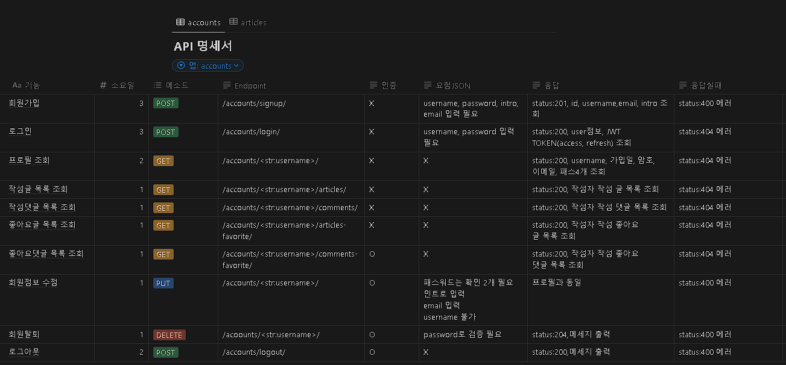
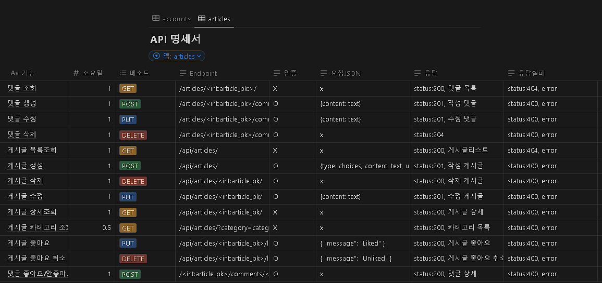
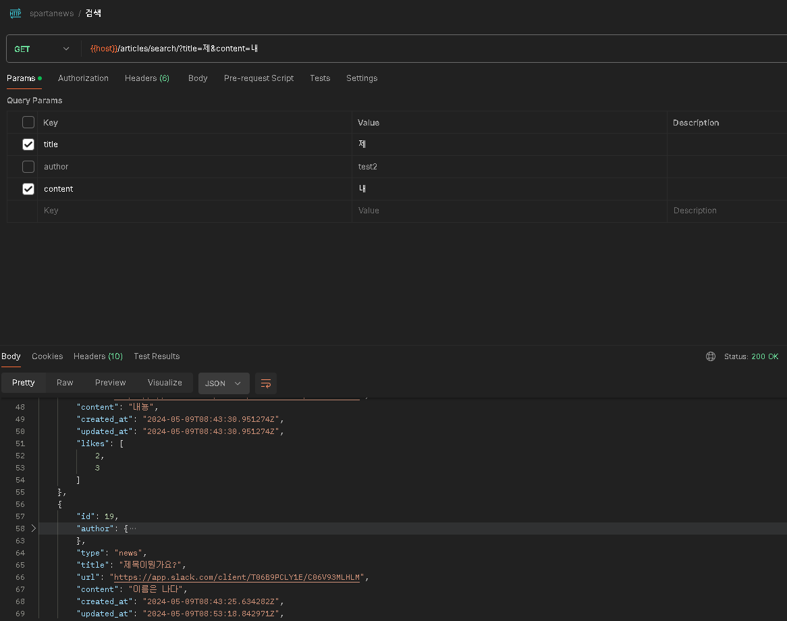

# spartamarket-DRF
### 프로젝트명 : 스파르타 뉴스 웹 만들기

## 프로젝트 소개
### DRF를 이용한 GEEKNES를 참조한 우리만의 뉴스 사이트 백엔드 구현하기
### 프로젝트 기간 : 2024.05.03 ~ 2024.05.10(8일)
 

## 역할분담
#### 박성현(팀장) : 전체 스케쥴 관리, 프로필 조회, 정보수정, 로그아웃, 회원탈퇴, 검색
#### 이준승(팀원) : 회원가입, 로그인, 로그아웃
#### 이은규(팀원) : 게시글 CRUD, 게시글 좋아요, 카테고리별 조회
#### 류종현(팀원) : 댓글 CRUD, 댓글 좋아요

## 기술 스택

| [Django](https://docs.djangoproject.com/ko/4.2/) | [Python](https://docs.python.org/ko/3.8/) |  [SQLite3](https://www.sqlite.org/docs.html)   
| :--------: | :--------: | :------: |
|       |       |  

## ERD

   
  
   

 

## API
<<<<<<< HEAD

 

## 구현 기능
### ACCOUNT
- 회원가입

<figure>
 
<figcaption>email과 username은 유니크해서 실패</figcaption>

<figure>
 
<figcaption>회원가입 성공</figcaption>

  

- 로그인

<figure>
 
<figcaption>username 존재 하지 않는 경우</figcaption>

<figure>
 
<figcaption>password 존재 하지 않는 경우</figcaption>

<figure>
 
<figcaption>로그인 성공 후 JWT 토큰 발급</figcaption>

  

- 로그아웃

<figure>
 
<figcaption>로그아웃한 상태에 한번 더 보내면 실패시 나옴</figcaption>

<figure>
 
<figcaption>로그아웃 성공</figcaption>

  

- 프로필 조회

<figure>
 
<figcaption>프로필 조회</figcaption>

  

- 작성 글 목록 조회

<figure>
 
<figcaption>id=3 작성글 조회</figcaption>

  

- 작성 댓글 목록 조회

<figure>
 
<figcaption>id=3 작성 댓글 조회</figcaption>

  

- 좋아요 글 목록 조회

<figure>
 
<figcaption>id=3 좋아요 글 조회</figcaption>

  

- 좋아요 댓글 목록 조회

<figure>
 
<figcaption>id=19 좋아요 댓글 조회</figcaption>

  

- 회원탈퇴

<figure>
 
<figcaption>비밀번호 틀리면 탈퇴 실패</figcaption>

<figure>
 
<figcaption>탈퇴 성공</figcaption>

  

- 회원정보 수정

<figure>
 
<figcaption>본인 아닌 경우</figcaption>

<figure>
 
<figcaption>수정 전</figcaption>

<figure>
 
<figcaption>수정 후</figcaption>

<figure>
 
<figcaption>패스워드는 두개 입력 받아 검증한 후 수정</figcaption>

<figure>
 
<figcaption>패스워드 수정 완료</figcaption>

  

### ARTICLES
- 게시글 목록 조회

<figure>
 
<figcaption>게시글 최신순 목록 조회</figcaption>

  

- 게시글 상세 조회

<figure>
 
<figcaption>댓글 들어간 게시글 상세조회</figcaption>

  

- 게시글 생성

<figure>
 
<figcaption>생성 로그인 필요</figcaption>

<figure>
 
<figcaption>생성 성공</figcaption>

  

- 게시글 수정

<figure>
 
<figcaption>게시글 제목은 필수 나머지는 blank 가능</figcaption>

<figure>
 
<figcaption>수정 성공</figcaption>

  

- 게시글 삭제

<figure>
 
<figcaption>삭제 완료</figcaption>

  

- 게시글 좋아요

<figure>
 
<figcaption>id=2인 게시글 좋아요</figcaption>

<figure>
 
<figcaption>id=2인 게시글 좋아요 삭제</figcaption>

  

- 댓글 생성

<figure>
 
<figcaption>댓글 생성</figcaption>

  

- 댓글 조회

<figure>
 
<figcaption>댓글 조회</figcaption>

  

- 댓글 수정

<figure>
 
<figcaption>댓글 수정</figcaption>

  

- 댓글 삭제

<figure>
 
<figcaption>댓글 삭제</figcaption>

  

- 댓글 좋아요

<figure>
 
<figcaption>id=2 댓글 좋아요</figcaption>

<figure>
 
<figcaption>id=2 댓글 좋아요 취소</figcaption>

  

- 검색

<figure>
 
<figcaption>쿼리셋으로 제목, 내용, 작성자를 구분해서 가진 것 모두를 조회</figcaption>

## PIP LIST
- requirements.txt 파일을 참고