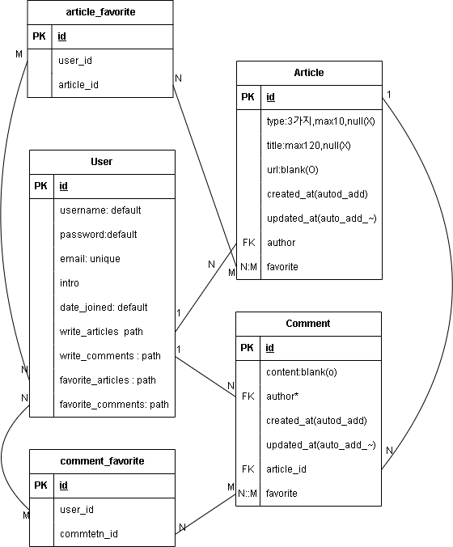

# spartamarket-DRF
### 프로젝트명 : 스파르타 뉴스 웹 만들기

## 프로젝트 소개
### DRF를 이용한 GEEKNES를 참조한 우리만의 뉴스 사이트 백엔드 구현하기
### 프로젝트 기간 : 2024.05.03 ~ 2024.05.10(8일)
 

## 기술 스택

| [Django](https://docs.djangoproject.com/ko/4.2/) | [Python](https://docs.python.org/ko/3.8/) |  [SQLite3](https://www.sqlite.org/docs.html)   
| :--------: | :--------: | :------: |
|       |       |  

## ERD

   
  
   

 

## 구현 기능
### ACCOUNT
- 회원가입

<figure>

<figcaption>username, email이 이미 존재한 경우</figcaption>

### ARTICLES
- ㅇㅇ

## API

 

## PIP LIST
- requirements.txt 파일을 참고